# Danish Public App Store Architecture

## DK-AppStore: A Sovereign App Distribution Platform

**Operated by Digitaliseringsstyrelsen (Danish Agency for Digital Government)**

---

## Executive Summary

This document describes the architecture for a Danish Public App Store built on F-Droid Server (fdroidserver) foundations, designed to host critical national applications such as MitID. The architecture prioritizes:

- **Security on par or exceeding Google Play and Apple App Store**
- **Privacy by Design (GDPR Article 25 compliance)**
- **Sovereignty and transparency**
- **Reproducible builds and verifiable software**

---

## Plain Language Summary

**The Current Situation:** When Danish citizens download MitID from Google Play or Apple's App Store, foreign corporations gain visibility into those downloads, usage patterns, and retain the ability to remove applications unilaterally. The Danish government has no operational control over this critical infrastructure.

**The Solution:** DK-AppStore is a sovereign Danish app distribution platform. Denmark controls the infrastructure, defines the security standards, and retains all data within national borders.

### Why Should Anyone Care?

| The Problem | Why It Matters | Our Solution |
|-------------|----------------|--------------|
| Google/Apple can see all your downloads | Privacy violation - they build profiles on you | **We don't track anything** |
| Foreign companies control critical apps | What if they remove MitID during a conflict? | **Danish servers, Danish control** |
| Nobody can check if apps are safe | You just have to trust them | **Anyone can verify our apps** |
| Closed source = hidden backdoors | Could be spying, you'd never know | **All code is public and checkable** |

### The Core Proposition

> DK-AppStore delivers an app distribution platform with security exceeding commercial alternatives, complete privacy protection, and full Danish sovereignty. Every application is built from publicly auditable source code, verified by multiple independent systems, and signed with cryptographic keys stored in certified hardware security modules. No user tracking. No profiling. No foreign dependencies for critical national infrastructure.

---

## How Is This Different From Commercial App Stores?

Commercial app stores serve their purpose for general consumer applications. However, for critical national infrastructure, the trust model presents significant concerns.

### The Trust Chain Problem

When MitID is installed from Google Play, the following trust assumptions are made:

1. **Google** - will not modify the application, inject tracking, or fail to secure their servers
2. **The Developer's Build Environment** - was not compromised during the upload process
3. **Google's Build System** - has no malicious actors with access
4. **The Network** - has not been subject to interception

These assumptions place critical national infrastructure at the mercy of foreign entities and unverifiable systems.

### The DK-AppStore Verification Model

```
Commercial Model:         Developer → Foreign Platform → User Device
                          (Trust is assumed at every step)

DK-AppStore Model:        Public Code → Multiple Independent Builders → Comparison → Signing → User Device
                          (Trust is verified at every step)
```

**Reproducible Build Verification:** Every application is built independently by a minimum of three separate build environments. If all builds produce cryptographically identical results, integrity is confirmed. If results diverge, the build is rejected and investigated.

This approach is analogous to having independent auditors verify financial statements: agreement confirms accuracy, disagreement indicates potential irregularities requiring investigation.

---

---

## The Building Blocks (For People Who Don't Code)

Before we dive into the technical diagrams, here's what all the pieces actually do:

| Component | What It Actually Does | Real-World Analogy |
|-----------|----------------------|-------------------|
| **Repository Server** | Stores all the apps | A library's book shelves |
| **Build Server** | Compiles source code into apps | A factory that builds LEGO sets from instructions |
| **HSM (Hardware Security Module)** | Stores the signing keys in a vault | A bank's vault for safety deposit boxes |
| **Signing Server** | Stamps apps as "verified authentic" | A notary public stamping documents |
| **CDN (Content Delivery Network)** | Distributes apps quickly across Denmark | Local 7-Eleven stores instead of one central warehouse |
| **Index Server** | Lists what apps are available | The library's card catalog |
| **Static Analysis** | Scans code for known problems | Automated review of code for security vulnerabilities |
| **Dynamic Analysis** | Runs apps in a sandbox to watch behavior | Testing application behavior in an isolated environment |

### The Journey of an App (From Code to Your Phone)

```
Step 1: Developer publishes source code publicly
           ↓
Step 2: We download and verify the code
           ↓
Step 3: Three separate computers build the app
           ↓
Step 4: We check all three builds are IDENTICAL
           ↓
Step 5: Security robots scan for problems
           ↓
Step 6: Security humans review critical apps
           ↓
Step 7: If everything passes, we sign it with our key (in the HSM vault)
           ↓
Step 8: App goes to the store, you can download it
           ↓
Step 9: Your phone verifies our signature before installing
```

**Rationale for this rigorous process:** MitID serves as the primary digital identity verification mechanism for Danish citizens, used for government services, banking, and healthcare. A compromise of MitID could enable identity theft, financial fraud, and unauthorized access to medical records at a national scale. The security requirements must be commensurate with these risks.

---

## 1. High-Level Architecture Overview

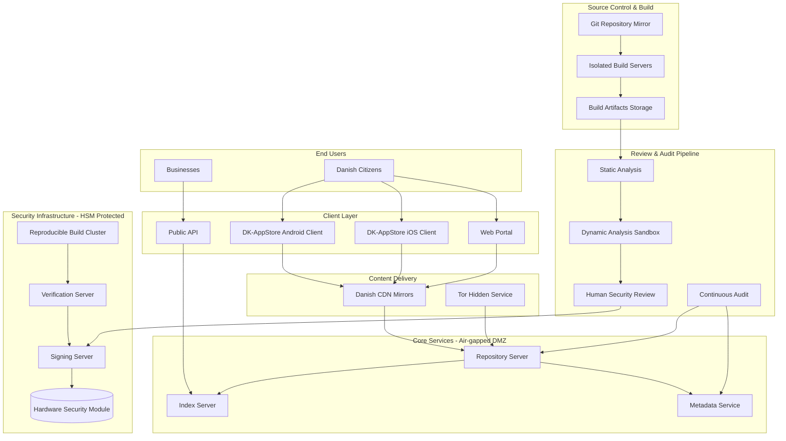

---

---

## Security Architecture: Verifiable by Design

Commercial app stores operate as closed systems. Their security practices cannot be independently verified, and their internal processes are not subject to public audit.

DK-AppStore adopts a fundamentally different approach based on verifiability:

1. **Open Source Infrastructure** - All platform code is publicly auditable
2. **Reproducible Builds** - Any party can independently verify application builds
3. **Hardware-Secured Signing** - Cryptographic keys are stored in tamper-resistant hardware security modules
4. **Published Audit Logs** - All security decisions and actions are documented and publicly accessible

---

## 2. Security Architecture

### 2.1 Security Model Comparison

| Security Feature | Google Play | Apple App Store | DK-AppStore |
|-----------------|-------------|-----------------|-------------|
| Code Signing | Play App Signing (Google-managed) | Apple-managed | HSM + Reproducible Builds |
| Review Process | Automated + Limited Manual | Automated + Manual | Triple-layer (Static + Dynamic + Human) |
| Reproducible Builds | No | No | **Yes - Mandatory** |
| Source Code Availability | No | No | **Yes - Mandatory** |
| Hardware Key Storage | Yes (Google) | Yes (Apple) | **Sovereign HSM (FIPS 140-3 Level 3)** |
| Build Transparency | No | No | **Full audit trail** |
| Third-party Verification | No | No | **Yes - Independent reproducers** |

### Explanation of Key Differentiators

- **Code Signing**: A cryptographic guarantee that the application originates from the verified source and has not been modified.
- **Reproducible Builds**: Commercial platforms require trust; DK-AppStore enables independent verification.
- **Hardware Key Storage**: The signing key is physically secured within the HSM and cannot be extracted, even by system administrators.
- **Third-party Verification**: Independent parties can rebuild applications and confirm binary-identical results, a capability not available with commercial app stores.

### 2.2 Signing Infrastructure

Digital signatures function similarly to traditional document signatures: they provide cryptographic proof that an application has been reviewed and approved by DK-AppStore.

The critical asset in this system is the signing key. If compromised, an attacker could sign malicious applications as if they were legitimate. To protect against this, the signing key is stored in a **Hardware Security Module (HSM)**, which provides:

- **Physical tamper resistance**: The device renders keys inaccessible if physical intrusion is detected
- **Multi-party access control**: No single individual can authorize signing operations (2-of-3 quorum required)
- **Comprehensive audit logging**: All operations are recorded in an immutable log
- **Certification**: FIPS 140-3 Level 3 compliance ensures the device meets stringent international security standards

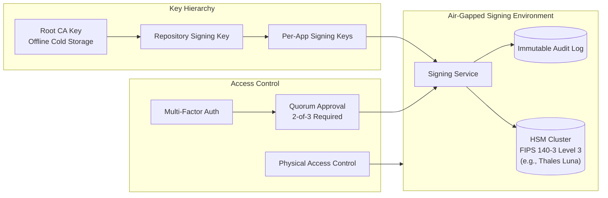

### 2.3 Multi-Layer Security Review Pipeline

**Why four layers?** Because each layer catches different problems:

| Layer | Detection Capability | Example Finding |
|-------|---------------------|-----------------|
| **Static Analysis** | Known vulnerability patterns in source code | Credentials transmitted without encryption |
| **Dynamic Analysis** | Runtime behavioral anomalies | Unauthorized network connections to foreign servers |
| **Human Review** | Sophisticated threats that evade automated detection | Obfuscated code containing deliberate vulnerabilities |
| **Reproducibility** | Build process tampering | Binary modifications introduced after compilation |

This layered approach ensures that different categories of threats are addressed by the most appropriate detection methodology. Automated systems provide comprehensive coverage, while human expertise addresses sophisticated attacks that require contextual analysis.

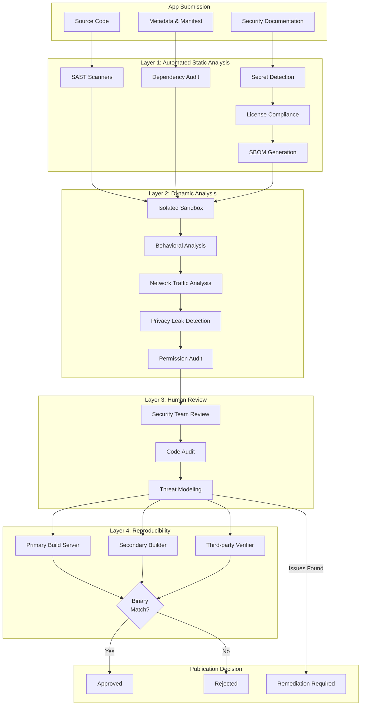

---

---

## 3. Privacy by Design Architecture

### Privacy Comparison

**Data collected by commercial app stores:**
- Complete download history per user account
- Application usage patterns and frequency
- Geographic location at time of download
- Device information and contact data (where permitted)
- Behavioral profiles used for advertising purposes

**Data collected by DK-AppStore:**
- No user accounts required
- No download tracking
- No telemetry collection
- Server logs containing IP addresses are anonymized within 7 days

**Aggregate Statistics:** For operational purposes (capacity planning, adoption metrics), DK-AppStore offers an optional, opt-in differential privacy system. This mathematical technique allows collection of aggregate statistics (e.g., total download counts) without the ability to determine any individual user's behavior.

### 3.1 Privacy Principles Implementation

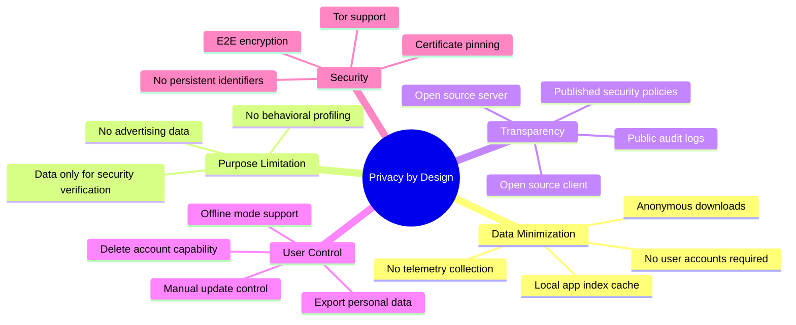

### 3.2 Data Flow with Privacy Controls

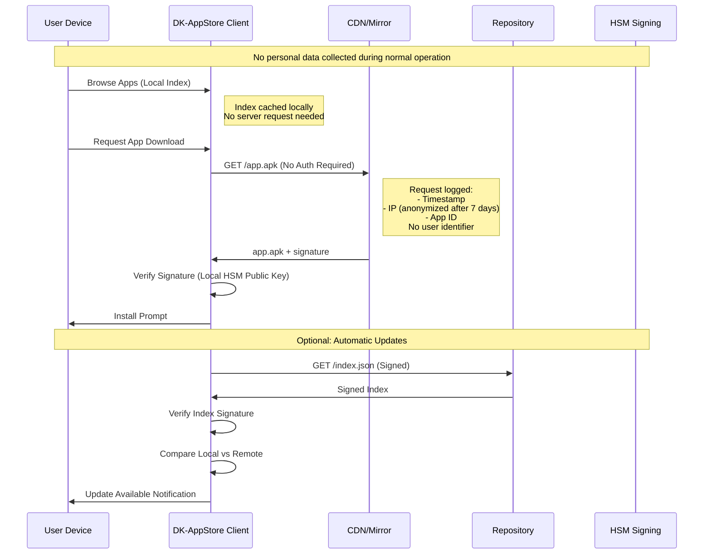

### 3.3 Privacy-Preserving Analytics (Optional)

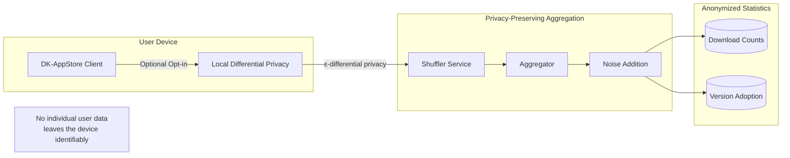

---

---

## 4. Core Components Architecture

### Foundation: F-Droid Server

DK-AppStore is built upon F-Droid Server (fdroidserver), an established open-source app distribution platform operational since 2010 with a global user base focused on privacy and security.

**Strategic rationale for this approach:**
- Over 13 years of security hardening and operational refinement
- Proven reliability serving millions of users worldwide
- Open source codebase with extensive community review
- Enables customization for Danish requirements without developing core infrastructure from scratch

This approach balances innovation with prudent risk management: leveraging proven technology for foundational components while developing Danish-specific enhancements for security, governance, and integration requirements.

### 4.1 Repository Structure (F-Droid Based)

**For the non-technical:** This is just how we organize files on our servers. Like folders on your computer, but very specific so everything works correctly.

```
dk-appstore/
├── repo/                          # Main repository
│   ├── index-v2.json             # Signed app index
│   ├── index-v2.json.asc         # PGP signature
│   ├── entry.json                # Entry point
│   ├── entry.json.asc            # Entry signature
│   ├── icons/                    # App icons (multiple densities)
│   ├── <package-id>/             # Per-app directory
│   │   ├── <version>.apk         # Signed APK
│   │   ├── <version>.apk.asc     # APK PGP signature
│   │   ├── <version>.apk.idsig   # APK Signature Scheme v4
│   │   └── metadata.json         # App metadata
│   └── ...
├── archive/                       # Archived older versions
├── metadata/                      # Build metadata (YAML)
├── build/                         # Build recipes
├── srclibs/                       # Shared source libraries
├── audit/                         # Security audit reports
│   ├── static-analysis/
│   ├── dynamic-analysis/
│   └── manual-review/
└── transparency/                  # Transparency logs
    ├── build-logs/
    ├── signing-logs/
    └── review-decisions/
```

### 4.2 Build Server Architecture

**What's a "build" anyway?**

Apps start as human-readable code (source code). This needs to be converted into something your phone can actually run (an APK file). This conversion is called "building" or "compiling."

The problem: during this process, someone could inject malicious code. The solution: we do it three times on separate systems and compare results.

**Ephemeral Virtual Machines:** Each build occurs in a freshly provisioned virtual machine that is destroyed immediately after the build completes. This eliminates the possibility of persistent compromise: even if a build environment were somehow compromised, that compromise would not persist to subsequent builds.

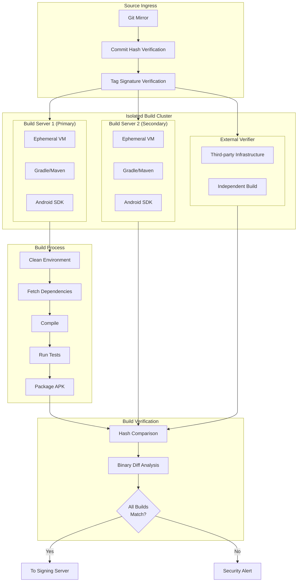

---

---

## 5. Critical Application Security (MitID Class)

### Enhanced Security for Critical National Applications

Applications are not equal in their risk profiles. A vulnerability in a gaming application represents an inconvenience; a vulnerability in MitID represents a potential national-scale identity theft incident affecting up to 6 million Danish citizens.

For MitID and other critical national applications (Sundhed.dk, Borger.dk), additional security requirements apply:

| Standard App | Critical App (MitID-level) |
|--------------|---------------------------|
| Automated security scan | Everything below PLUS... |
| Human review | Annual penetration testing by external hackers |
| Reproducible builds | Formal mathematical proofs of correctness |
| Regular updates | 24/7 incident response team |
| Best effort availability | 99.99% uptime guarantee (52 minutes downtime/year max) |

### 5.1 Enhanced Security for National Critical Apps

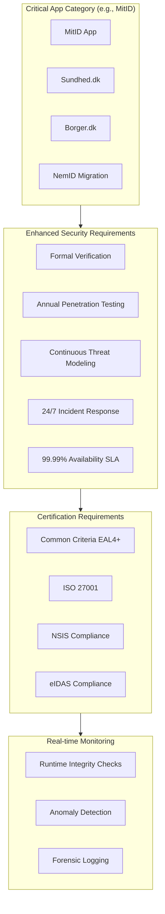

### 5.2 MitID Integration Architecture

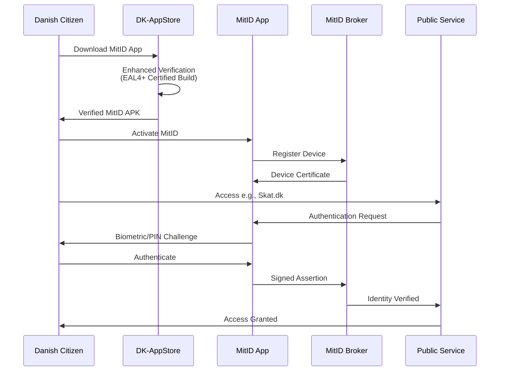

---

---

## 6. Infrastructure Architecture

### Physical Infrastructure Overview

DK-AppStore operates from two geographically separated data centers: Copenhagen (primary) and Aarhus (secondary).

**Rationale for dual-site architecture:**
1. **Continuity of operations**: Service continues if either site experiences an outage (natural disaster, power failure, network disruption)
2. **Performance optimization**: Users are automatically routed to the nearest available site
3. **Resilience against targeted attacks**: No single point of failure exists

**Air-Gapped Networks:** The signing infrastructure operates on networks that are physically isolated from the internet. Data transfer into and out of these environments requires controlled physical media transfer with multi-party authorization. This architecture ensures that even a complete compromise of internet-facing systems cannot reach the signing keys.

### 6.1 Physical Infrastructure

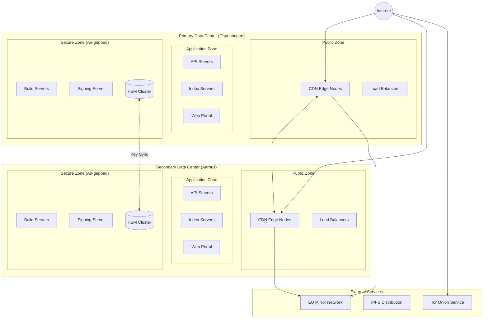

### 6.2 Network Security Architecture

**DDoS Mitigation:** Distributed Denial of Service attacks attempt to overwhelm services with massive volumes of illegitimate traffic, rendering them unavailable to legitimate users.

DK-AppStore partners with Danish ISPs to implement traffic filtering at the network edge, neutralizing attack traffic before it reaches the application infrastructure. This distributed defense model provides resilience proportional to the combined capacity of participating network providers.

**Tor Hidden Service:** DK-AppStore maintains a Tor onion service, enabling access for users requiring enhanced privacy protections. This ensures availability even when users cannot safely reveal their interest in accessing Danish government services, or when conventional network paths are disrupted or surveilled.

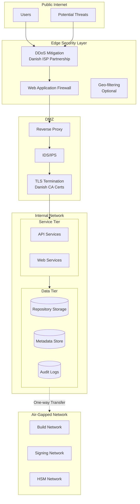

---

---

## 7. Governance and Operations

### Governance Structure

**Organizational hierarchy:**
1. **Ministry of Finance** → Strategic oversight and ministerial accountability
2. **Digitaliseringsstyrelsen** → Operational responsibility and day-to-day management
3. **Security Advisory Board** → Independent security experts with authority to block deployments
4. **Operations Teams** → Technical staff responsible for platform operation and maintenance

**Independent Security Oversight:** The Security Advisory Board includes external experts, including representatives from CFCS (Centre for Cyber Security), with explicit authority to override operational decisions on security grounds. This separation of responsibilities ensures that security considerations are not subordinated to operational pressures or timelines. If the Security Advisory Board determines an application poses unacceptable risk, publication is blocked regardless of other considerations.

### 7.1 Organizational Structure

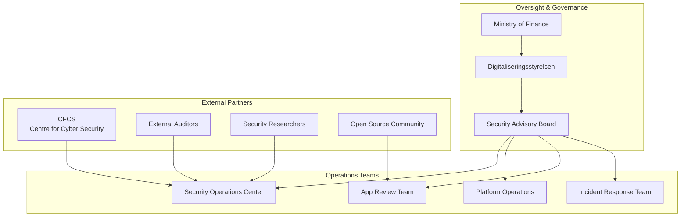

### 7.2 Incident Response Flow

**Incident Response Procedures**

When security vulnerabilities are identified:

| Severity | Response Time | Actions |
|----------|---------------|---------|
| **Low** | 24 hours | Investigation initiated, remediation scheduled for next regular update cycle |
| **Medium** | 4 hours | Incident team assembled, expedited patch development |
| **High** | 1 hour | Leadership notification, emergency patch deployment |
| **Critical** | 15 minutes | Immediate application suspension, user notification, full incident response activation |

For critical severity incidents (such as a compromise of MitID), DK-AppStore maintains the capability to immediately suspend application availability nationwide. This emergency measure prevents further exposure while remediation is developed and verified.

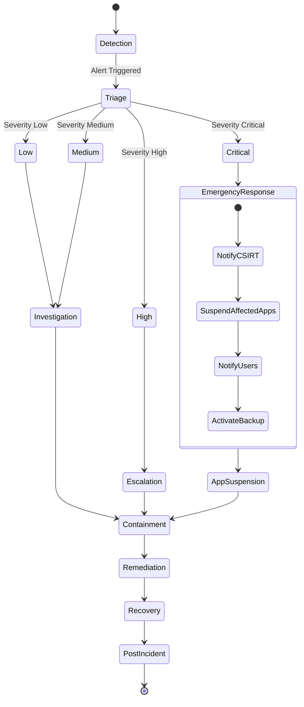

---

---

## 8. Compliance and Certification

### Regulatory and Certification Framework

DK-AppStore operates within a comprehensive compliance framework. The following standards and regulations apply:

| Standard | Description | Relevance to DK-AppStore |
|----------|-------------|-------------------------|
| **GDPR** | EU General Data Protection Regulation | Legal framework governing privacy-by-design implementation |
| **eIDAS** | EU Regulation on electronic identification | Ensures MitID maintains legal recognition across EU member states |
| **NSIS** | Danish National Standard for Identity Security | Compliance required for MitID-class applications |
| **NIS2** | EU Network and Information Security Directive | Mandates security monitoring and incident reporting obligations |
| **ISO 27001** | Information Security Management System | Third-party certification of security management practices |
| **Common Criteria EAL4+** | Security evaluation methodology | HSM components evaluated against rigorous attack scenarios |
| **FIPS 140-3** | Cryptographic module security standard | Certification of cryptographic implementation correctness |

### 8.1 Regulatory Compliance Matrix

| Regulation/Standard | Requirement | Implementation |
|---------------------|-------------|----------------|
| **GDPR** | Privacy by Design | No tracking, data minimization, user control |
| **eIDAS** | Trust Services | HSM-based signing, qualified certificates |
| **NSIS** | National Security Standard | Full compliance for MitID-class apps |
| **NIS2** | Critical Infrastructure | Security monitoring, incident reporting |
| **ISO 27001** | ISMS | Certified security management |
| **Common Criteria** | Security Evaluation | EAL4+ for critical components |
| **FIPS 140-3** | Cryptographic Modules | Level 3 HSM compliance |

### 8.2 Audit and Transparency

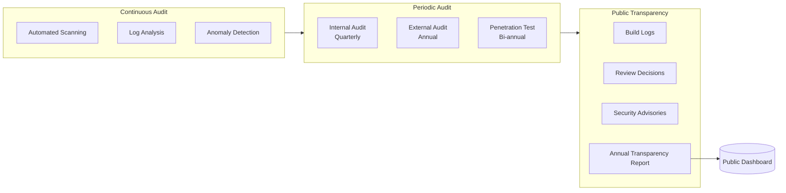

---

---

## 9. Client Application Architecture

### Client Application Overview

The DK-AppStore client applications provide the user interface for browsing and installing applications on both Android and iOS platforms.

> **Architecture Decision:** Shared Rust core with platform-specific UI layers.  
> See [ADR-002: iOS Distribution Strategy](docs/architecture/adr-002-ios-distribution-strategy.md) for full rationale.

**Cross-Platform Strategy**: Security-critical logic is implemented once in Rust and shared across both platforms via FFI bindings. This ensures:
- Single audit surface for cryptographic operations
- Consistent security behavior across platforms
- ~70% code sharing between Android and iOS clients

**Offline-First Architecture**: The application index is cached locally, enabling full browsing functionality without network connectivity. Index updates occur opportunistically when connectivity is available.

**No Account Requirement**: Users can browse, download, and install applications without creating accounts or providing identifying information. This design decision directly implements privacy-by-design principles.

**Security Features**:
- **Certificate pinning**: Implemented in Rust core, prevents man-in-the-middle attacks using fraudulent certificates
- **Device integrity detection**: Warns users if the device operating system has been modified in ways that could compromise security
- **Application integrity verification**: Validates that the client application itself has not been tampered with
- **Signature verification**: All cryptographic verification in Rust for memory safety
- **Optional Tor integration**: Enables anonymous access for users requiring enhanced privacy

### 9.0 Shared Client Core Architecture

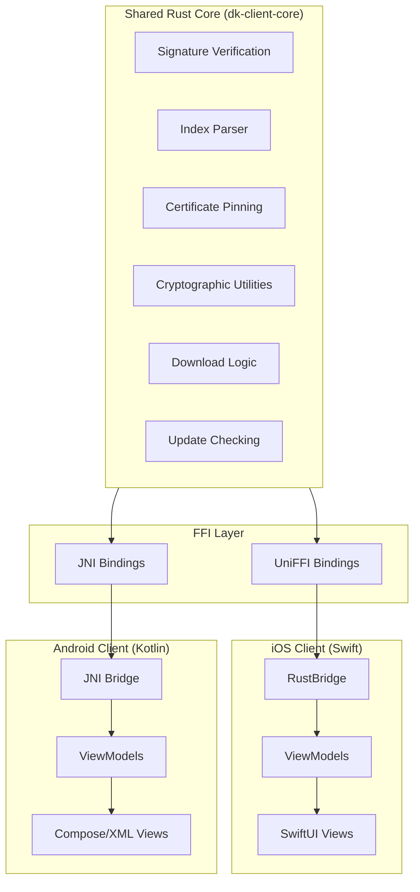

**Rust Core Responsibilities:**
| Function | Implementation | Rationale |
|----------|----------------|-----------|
| Index signature verification | `ring` crate | Memory-safe cryptography |
| APK/IPA signature verification | `ring` + platform parsers | Consistent verification logic |
| Certificate pinning | `rustls` | Single pinning implementation |
| Index parsing | `serde` | Type-safe deserialization |
| Download integrity | SHA-256 in `ring` | Verified checksums |

**Platform UI Responsibilities:**
| Function | Android | iOS |
|----------|---------|-----|
| UI rendering | Kotlin + Compose/XML | Swift + SwiftUI |
| System integration | Android SDK | iOS SDK |
| App installation | PackageInstaller API | DMA Web Distribution |
| Background updates | WorkManager | Background App Refresh |
| Local storage | Room | SwiftData/CoreData |

### 9.1 DK-AppStore Android Client

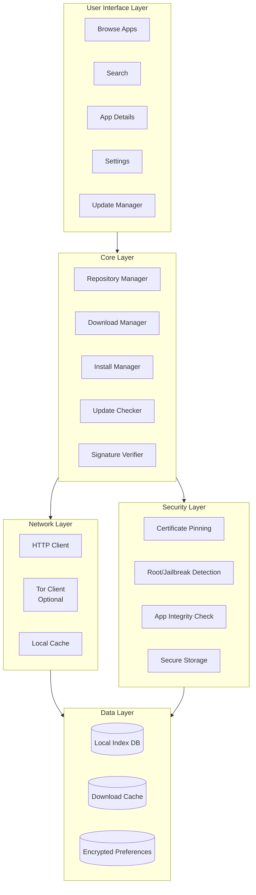

### 9.2 Offline-First Design

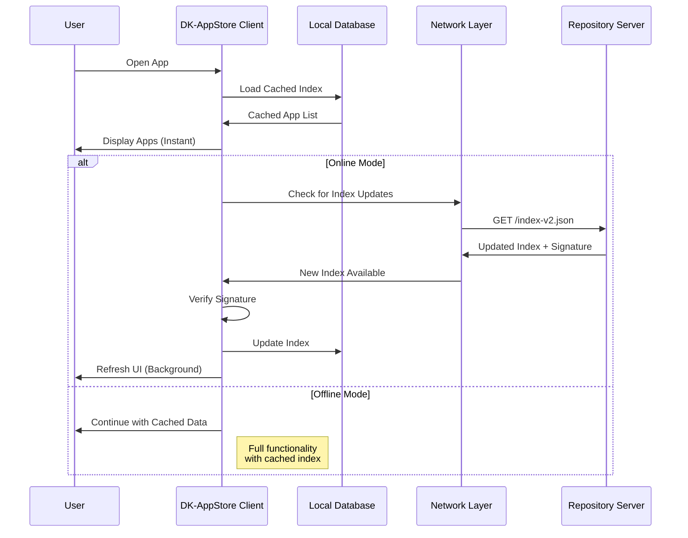

### 9.3 DK-AppStore iOS Client

The iOS client provides equivalent functionality to the Android client, using the same shared Rust core for all security-critical operations. Distribution leverages the EU Digital Markets Act (DMA) provisions for alternative app distribution.

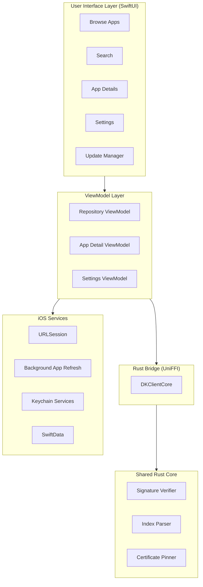

### 9.4 iOS Distribution via DMA Web Distribution

Apple's Digital Markets Act compliance enables alternative app distribution in the EU. DK-AppStore uses **Web Distribution**, which allows apps to be installed directly from the DK-AppStore website after Apple notarization.

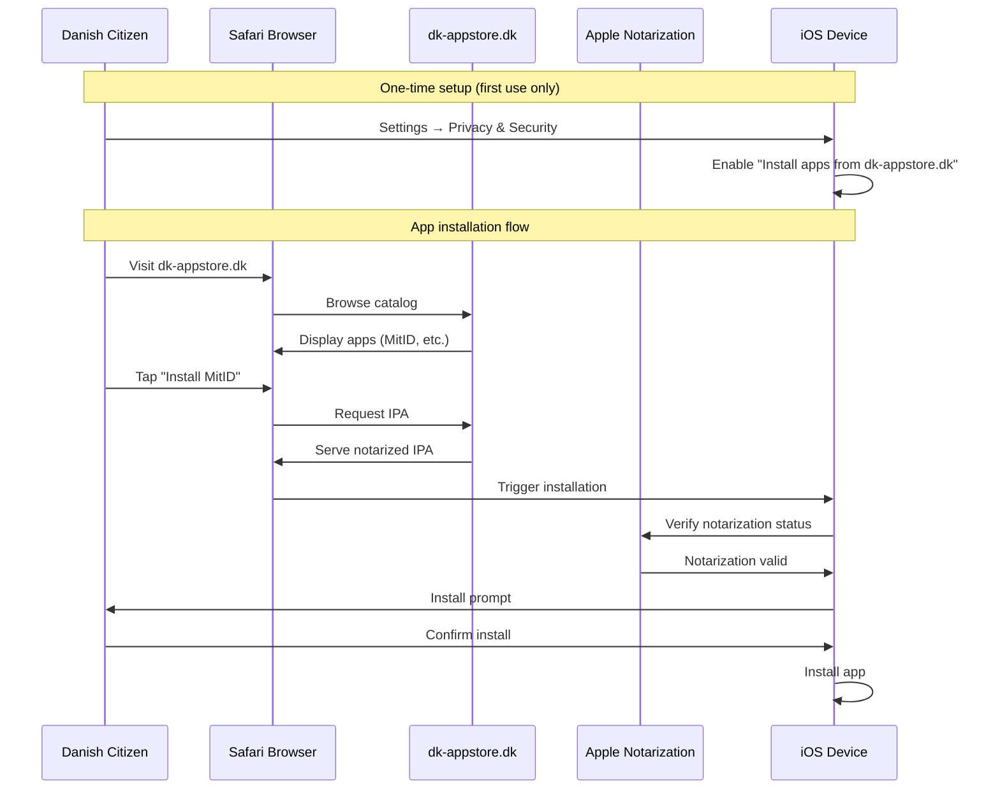

**DMA Web Distribution Requirements:**

| Requirement | DK-AppStore Implementation |
|-------------|---------------------------|
| Apple Developer Program membership | DIGST enrolled as organization |
| EU Alternative Distribution terms | Accepted |
| App notarization | All IPAs submitted to Apple for malware scanning |
| Web hosting | IPAs hosted on Danish infrastructure (dk-appstore.dk) |
| User opt-in | Users enable web distribution per-domain in Settings |

**Comparison: Android vs iOS Distribution**

| Aspect | Android | iOS |
|--------|---------|-----|
| User opt-in required | No (sideloading standard) | Yes (one-time setting toggle) |
| Platform approval | None | Notarization (malware scan only) |
| Distribution method | Direct APK download | DMA Web Distribution |
| Update mechanism | In-app update check | In-app update check |
| Installation friction | Low | Medium (first-time setup) |

---

---

## 10. Deployment and Operations

### Deployment Strategy

**Blue/Green Deployment Model**: DK-AppStore maintains two identical production environments. Updates are deployed to the inactive environment, thoroughly tested, and then traffic is switched from the active to the updated environment. If issues are detected post-deployment, traffic can be reverted to the previous environment within seconds.

This approach eliminates deployment-related service disruptions and provides immediate rollback capability for any deployment that does not perform as expected.

### 10.1 Deployment Pipeline

```mermaid
flowchart LR
    subgraph Development["Development"]
        code[Code Changes]
        test[Automated Tests]
        review[Code Review]
    end

    subgraph Staging["Staging"]
        deploy_stage[Deploy to Staging]
        integration[Integration Tests]
        security_scan[Security Scan]
        approval[Manual Approval]
    end

    subgraph Production["Production (Blue/Green)"]
        blue[Blue Environment]
        green[Green Environment]
        switch[Traffic Switch]
    end

    subgraph Monitoring["Monitoring"]
        health[Health Checks]
        metrics[Metrics]
        alerts[Alerts]
        rollback[Automatic Rollback]
    end

    code --> test
    test --> review
    review --> deploy_stage
    deploy_stage --> integration
    integration --> security_scan
    security_scan --> approval
    approval --> green
    green --> switch
    switch --> blue
    
    blue --> health
    green --> health
    health --> metrics
    metrics --> alerts
    alerts --> rollback
```

---

---

## 11. Technology Stack

### Technology Selection Principles

The technology stack prioritizes open source solutions where appropriate. This approach provides:

1. **Auditability**: Source code is available for security review by any interested party
2. **Vendor independence**: No dependency on a single commercial vendor for critical components
3. **Cost efficiency**: No per-user licensing costs regardless of adoption scale
4. **Community security**: Vulnerabilities are identified and addressed by a global developer community

### 11.1 Recommended Technologies

| Component | Technology | Rationale |
|-----------|------------|-----------|
| **Repository Server** | fdroidserver (Python) | Proven, open source, auditable |
| **Build System** | Gradle + fdroidserver | Standard Android toolchain |
| **HSM** | Thales Luna / Utimaco | FIPS 140-3 Level 3 certified |
| **Container Runtime** | Podman (rootless) | Security-focused, no daemon |
| **Orchestration** | Kubernetes (hardened) | Scalability, resilience |
| **CI/CD** | GitLab CI (self-hosted) | Air-gapped capable |
| **Monitoring** | Prometheus + Grafana | Open source, comprehensive |
| **Log Management** | OpenSearch | Scalable, open source |
| **CDN** | Self-hosted + Danish ISP | Data sovereignty |
| **Database** | PostgreSQL | Reliable, open source |
| **Cache** | Redis | Performance |
| **Message Queue** | RabbitMQ | Reliable messaging |

### 11.2 Client Technologies

| Component | Technology | Rationale |
|-----------|------------|-----------|
| **Shared Client Core** | Rust | Memory safety, single audit surface (ADR-002) |
| **Android UI** | Kotlin + Compose | Modern Android development |
| **iOS UI** | Swift + SwiftUI | Modern iOS development |
| **Android FFI** | JNI | Standard Android native interface |
| **iOS FFI** | UniFFI | Type-safe Swift bindings from Rust |
| **Android Distribution** | Direct APK | Standard sideloading |
| **iOS Distribution** | DMA Web Distribution | EU alternative distribution compliance |

---

---

## 12. Migration and Rollout Strategy

### Phased Implementation Approach

Deployment of critical national infrastructure requires methodical planning and staged validation. The rollout proceeds in three phases, with an accelerated timeline enabled by the open source development model.

**Phase 1 (Foundation + Pilot)**: Parallel infrastructure deployment, security certification, and early testing. Open source development enables community validation concurrent with formal certification processes.

**Phase 2 (Critical Applications)**: Migration of MitID as the initial critical application. Commercial vendor assumes operational responsibility.

**Phase 3 (General Availability)**: Platform opens for all Danish government applications and third-party developer onboarding begins.

### 12.1 Accelerated Rollout Timeline

**Timeline acceleration strategies:**

| Original Approach | Accelerated Approach | Time Saved |
|-------------------|---------------------|------------|
| Sequential certification → development | Parallel certification + open source development | 3-4 months |
| Single build/test track | Community testing concurrent with formal QA | 2 months |
| Full custom client development | Fork existing F-Droid client, Danish customizations only | 2-3 months |
| MitID → Sundhed → Borger sequential | Parallel app integration workstreams | 3 months |

```mermaid
gantt
    title DK-AppStore Accelerated Rollout Timeline
    dateFormat  YYYY-MM
    
    section Phase 0: Open Source Foundation (Pre-Contract)
    Community Architecture Review    :2026-01, 3M
    Open Source Core Development     :2026-02, 5M
    F-Droid Client Fork & Customize  :2026-03, 4M
    
    section Phase 1: Foundation + Pilot (Contract Start)
    Infrastructure Setup             :2026-06, 3M
    Security Certification           :2026-06, 5M
    Commercial Vendor Onboarding     :2026-06, 2M
    Internal Testing                 :2026-08, 2M
    Limited Public Beta              :2026-09, 2M
    Security Audit                   :2026-10, 2M
    
    section Phase 2: Critical Apps
    MitID Migration                  :2026-11, 4M
    Sundhed.dk Integration           :2026-11, 4M
    Borger.dk Apps                   :2026-12, 3M
    
    section Phase 3: General Availability
    Public Launch                    :2027-03, 1M
    Third-party Developer Program    :2027-04, 2M
    Full Feature Rollout             :2027-05, 2M
```

**Result:** Public launch achievable by Q1 2027 (9 months from contract start), compared to 18 months under traditional sequential approach.

### 12.2 Open Source Development Model

DK-AppStore adopts a **community-to-commercial handover model** that enables immediate development while ensuring professional operational support.

```mermaid
flowchart LR
    subgraph Phase0["Phase 0: Open Source (Now → Contract)"]
        community[Community Contributors]
        digst_lead[DIGST Technical Lead]
        public_repo[Public GitHub Repository]
        
        community --> public_repo
        digst_lead --> public_repo
    end
    
    subgraph Phase1["Phase 1: Handover (Contract Start)"]
        vendor[Commercial Vendor]
        audit[Code Audit]
        transfer[Knowledge Transfer]
        
        public_repo --> audit
        audit --> vendor
        digst_lead --> transfer
        transfer --> vendor
    end
    
    subgraph Phase2["Phase 2: Operations (Ongoing)"]
        vendor_ops[Vendor Operations]
        community_contrib[Community Contributions]
        digst_oversight[DIGST Oversight]
        
        vendor --> vendor_ops
        community_contrib --> vendor_ops
        digst_oversight --> vendor_ops
    end
```

#### Development Governance Structure

| Role | Phase 0 (Pre-Contract) | Phase 1+ (Post-Contract) |
|------|----------------------|-------------------------|
| **Code ownership** | DIGST (Apache 2.0 / EUPL license) | DIGST (unchanged) |
| **Development lead** | DIGST technical staff + community | Commercial vendor |
| **Code review** | Community + DIGST | Vendor + DIGST approval |
| **Infrastructure** | Community/cloud (non-production) | Vendor-operated (production) |
| **Security certification** | N/A | Vendor responsibility |
| **Operational SLA** | None | Contractually defined |

#### Advantages of This Model

1. **Immediate start**: Development begins now without procurement delays
2. **Reduced vendor risk**: Code exists and is proven before vendor selection
3. **Competitive procurement**: Multiple vendors can bid on operating existing code
4. **Transparency**: All development history publicly visible
5. **Community validation**: Security researchers can review code before production
6. **Knowledge retention**: DIGST retains deep technical understanding regardless of vendor

#### Vendor Requirements for Handover

The commercial vendor contract shall require:

- **Code contribution**: All vendor modifications submitted to public repository
- **Knowledge transfer**: Minimum 4-week overlap with open source contributors
- **Documentation**: Complete operational runbooks before go-live
- **Escrow**: Build environments and procedures escrowed for continuity
- **Exit provisions**: Full code and operational transfer capability if vendor changes

#### Licensing Strategy

| Component | License | Rationale |
|-----------|---------|-----------|
| Server infrastructure | EUPL-1.2 | EU-endorsed, compatible with AGPL, ensures public sector reuse |
| Client application | Apache-2.0 | Maximum compatibility, enables commercial distribution |
| Documentation | CC-BY-4.0 | Enables reuse with attribution |
| Build configurations | CC0 | Public domain, no restrictions |

This licensing ensures:
- Any EU member state can fork and operate their own instance
- Commercial vendors can operate without license encumbrance
- Community contributions flow back to the project
- No single entity can "capture" the codebase

---

---

## 13. Risk Assessment

### Threat Analysis and Mitigation

A realistic security posture requires honest assessment of potential failure modes. The following scenarios represent the most significant threats:

**1. Signing Key Compromise** → Attacker could publish malicious applications with valid signatures
- *Mitigation*: Keys stored in HSMs with tamper-triggered destruction, multi-party authorization (2-of-3 quorum), comprehensive audit logging

**2. Supply Chain Attack** → Malicious code introduced via third-party dependencies
- *Mitigation*: Comprehensive dependency scanning, mandatory reproducible builds, complete Software Bill of Materials (SBOM) tracking

**3. Insider Threat** → Malicious action by authorized personnel
- *Mitigation*: Separation of duties (no single individual can perform sensitive operations), comprehensive audit logging, personnel security procedures

**4. Zero-Day Vulnerability** → Previously unknown attack vector exploited before patch availability
- *Mitigation*: Immediate application suspension capability, 24/7 incident response, regular penetration testing by external security researchers

### 13.1 Key Risks and Mitigations

| Risk | Impact | Likelihood | Mitigation |
|------|--------|------------|------------|
| HSM Key Compromise | Critical | Low | Multi-party key ceremony, quorum signing, HSM tamper detection |
| Supply Chain Attack | Critical | Medium | Reproducible builds, multiple independent verifiers, SBOM tracking |
| DDoS Attack | High | High | Danish ISP partnerships, geographic distribution, Tor fallback |
| Insider Threat | High | Low | Separation of duties, audit logging, background checks |
| Zero-day Exploit | High | Medium | Rapid incident response, automatic app suspension capability |
| Build Server Compromise | Critical | Low | Ephemeral VMs, air-gapped signing, reproducibility verification |

---

---

## 14. Conclusion

### The Bottom Line

The DK-AppStore architecture provides a sovereign, transparent, and secure app distribution platform that:

1. **Exceeds commercial app store security** through mandatory reproducible builds, triple-layer review, and HSM-based signing
2. **Ensures privacy by design** with no user tracking, anonymous downloads, and local-first client design
3. **Enables transparency** via open source components, public audit logs, and verifiable builds
4. **Supports critical national infrastructure** with enhanced security tiers for apps like MitID
5. **Maintains sovereignty** with Danish-hosted infrastructure and compliance with EU/Danish regulations

This architecture positions Denmark as a leader in trustworthy public digital infrastructure while maintaining full compatibility with standard Android app distribution.

---

---

## Frequently Asked Questions

**Q: Is this duplicating existing infrastructure unnecessarily?**
A: No. DK-AppStore leverages the established F-Droid platform as its foundation, adding Danish-specific security enhancements, governance structures, and integration capabilities. This approach minimizes development risk while achieving sovereignty requirements.

**Q: Why not continue using commercial app stores?**
A: Commercial app stores are appropriate for general consumer applications. However, national identity infrastructure requires sovereign control. Consider the implications if international sanctions, corporate policy changes, or geopolitical events resulted in removal of MitID from commercial platforms.

**Q: What is the cost justification?**
A: The investment must be weighed against the potential cost of a national identity infrastructure breach. A successful compromise of MitID could enable fraud at a national scale, with potential costs in the billions of kroner. DK-AppStore represents a proportionate investment in critical infrastructure protection.

**Q: Will citizens need to learn a new system?**
A: No. The user experience is designed to be seamless. When installing MitID, citizens will be directed to DK-AppStore automatically. The installation process requires a single confirmation.

**Q: What about iOS devices?**
A: DK-AppStore supports iOS through EU Digital Markets Act (DMA) Web Distribution. Danish citizens can install the DK-AppStore iOS client and apps like MitID directly from dk-appstore.dk after enabling a one-time setting on their device. The iOS client shares ~70% of its code with the Android client through a common Rust core, ensuring identical security guarantees on both platforms. See [ADR-002: iOS Distribution Strategy](docs/architecture/adr-002-ios-distribution-strategy.md) for technical details.

**Q: How can stakeholders verify claims made in this document?**
A: All platform code will be publicly available. All builds will be independently reproducible. All audit reports will be published. The verification principle underlying DK-AppStore applies equally to this documentation.

---

## Appendix A: Glossary

| Term | Technical Definition | Accessible Explanation |
|------|---------------------|----------------------|
| **HSM** | Hardware Security Module - tamper-resistant device for cryptographic operations | Specialized hardware that secures cryptographic keys and renders them inaccessible if physical tampering is detected |
| **Reproducible Build** | Build process that produces identical binaries from identical source | A verifiable process where the same source code always produces the exact same application, enabling independent verification |
| **NSIS** | National Standard for Identity Security (Danish eIDAS equivalent) | Danish regulatory framework governing identity security requirements |
| **SBOM** | Software Bill of Materials - list of all components in software | Complete inventory of all software components and dependencies used in an application |
| **EAL** | Evaluation Assurance Level (Common Criteria) | Standardized security certification levels indicating the rigor of security evaluation performed |
| **Air-gapped** | Physically isolated from network connections | Systems with no physical network connectivity, requiring manual data transfer procedures |
| **APK** | Android Package Kit | The standard file format for Android applications |
| **CDN** | Content Delivery Network | Geographically distributed servers that deliver content from locations nearest to users |
| **CI/CD** | Continuous Integration / Continuous Deployment | Automated systems that build, test, and deploy software changes |
| **DDoS** | Distributed Denial of Service | Attack method that overwhelms services with traffic volume, causing unavailability |
| **PKI** | Public Key Infrastructure | Framework for managing digital certificates and cryptographic key pairs |
| **SAST** | Static Application Security Testing | Security analysis of source code without executing the application |
| **Tor** | The Onion Router | Anonymity network that prevents traffic analysis and provides privacy protection |

## Appendix B: References

- [F-Droid Server Documentation](https://f-droid.org/docs/)
- [F-Droid Security Model](https://f-droid.org/docs/Security_Model/)
- [Danish National Cyber Security Strategy](https://digst.dk/media/bxxcnby2/digst_ncis_2022-2024_uk.pdf)
- [MitID Security Architecture](https://www.mitid.dk/en-gb/security/security-behind-mitid/)
- [eIDAS Regulation](https://digital-strategy.ec.europa.eu/en/policies/eidas-regulation)
- [GDPR Article 25 - Data Protection by Design](https://gdpr-info.eu/art-25-gdpr/)
